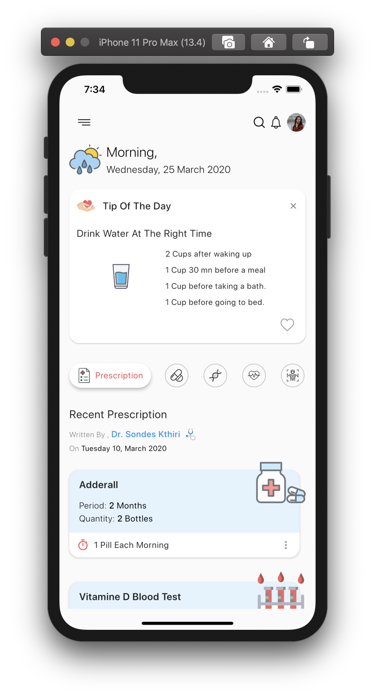
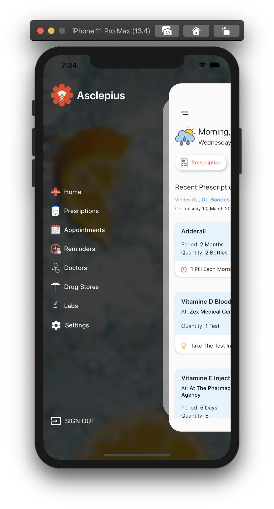
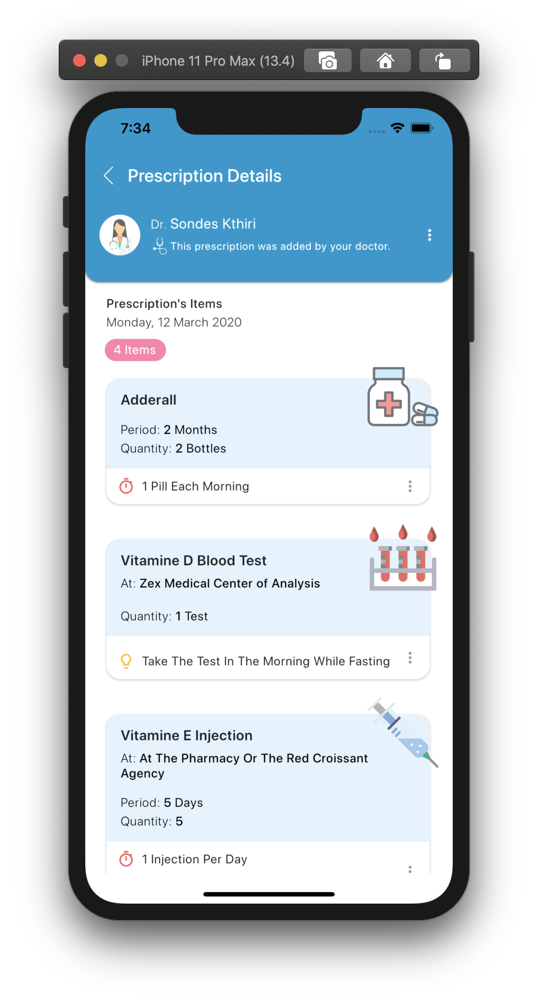

# Asclepius
Asclepius is a flutter application dedicated to prescriptions' management. This app is open source and made for educational purposes only.

<p align="center">
  
</p>

<p align="center">
 
 
 
</p>

## Getting Started

These instructions will get you a copy of the project up and running on your local machine for development and testing purposes.

## Prerequisites

You'll need to be having flutter installed in your local machine, if not so, here's the official detailed documentation:

```
https://flutter.dev/docs/get-started/install
```

## Installing

A step by step series of examples that tell you how to get a development env running

#### Step 1:

Download or clone this repo by using the link below:

```
git clone https://github.com/kthirirania/kthirirania-asclepius.git

```

#### Step 2:

Open a Simulator or plugin your phone.

#### Step 3:

Go to project root and execute the following command in console to get the required dependencies:

```
flutter pub get
```

```
flutter run
```

If you have multiple connected devices run:

```
flutter devices
```

```
flutter run -f [device_id]
```

## Authors

* **Rania Kthiri** - *Initial work* - [Rania Kthiri](https://github.com/kthirirania)

## License

This project is licensed under the MIT License - see the [LICENSE.md](LICENSE.md) file for details


